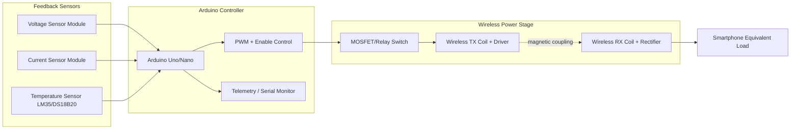
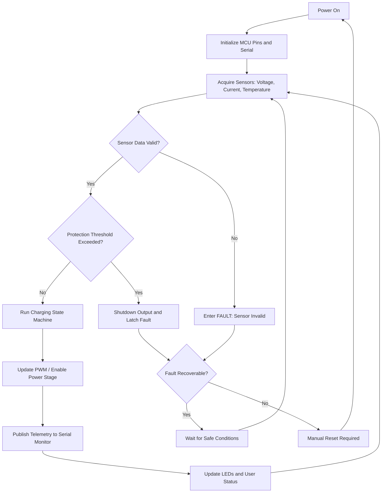
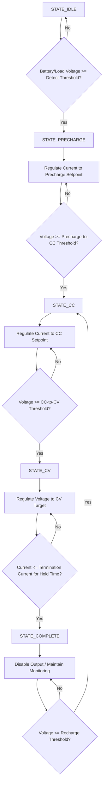
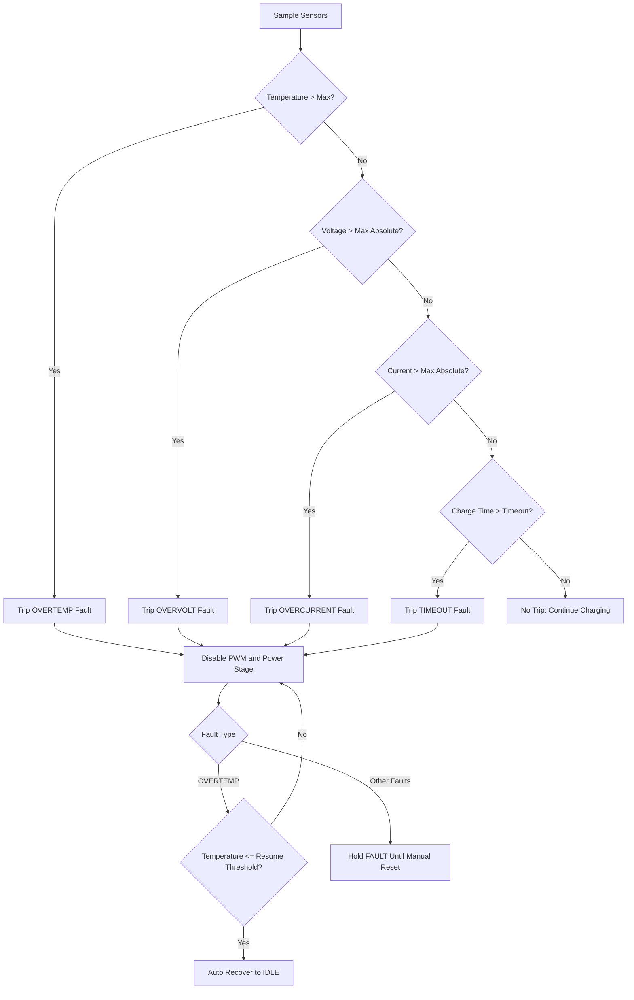

# Arduino Based Wireless Smartphone Charging Controller

An IEEE-style embedded systems project implementing a closed-loop wireless charging controller using Arduino, analog sensing, staged charging logic, and multi-layer protection.

## 1. Project Overview
Wireless smartphone charging systems must balance efficiency, thermal behavior, and charging safety. This project develops a practical controller firmware and simulation framework that:

1. Regulates charging power with feedback from voltage/current sensors.
2. Improves charging reliability using staged control (Precharge/CC/CV).
3. Enforces protection mechanisms for overtemperature, overvoltage, overcurrent, and abnormal charging duration.
4. Provides serial telemetry for real-time monitoring and validation.

## 2. Key Features
1. Arduino-based real-time control loop.
2. Sensor acquisition for voltage, current, and temperature.
3. Charging state machine:
   - IDLE
   - PRECHARGE
   - CONSTANT CURRENT (CC)
   - CONSTANT VOLTAGE (CV)
   - COMPLETE
   - FAULT
4. Safety subsystem with automatic shutdown.
5. Telemetry output for logging, debugging, and results analysis.
6. Proteus build guide for simulation-first verification.

## 3. Repository Structure
```text
.
|-- LICENSE
|-- README.md
|-- diagrams/
|   |-- charging-control-logic.mmd
|   |-- protection-mechanism.mmd
|   |-- system-block-diagram.mmd
|   `-- system-flowchart.mmd
|-- docs/
|   |-- mermaid-export-guide.md
|   |-- proteus-simulation-guide.md
|   `-- system-design.md
|-- simulation/
|   `-- README.md
`-- src/
    `-- wireless_charging_controller/
    |-- control_core.c
    |-- control_core.h
        `-- wireless_charging_controller.ino
```

## 4. System Architecture
### 4.1 Block Diagram (Mermaid)


### 4.2 Hardware Components
1. Arduino Uno/Nano
2. Wireless charging transmitter and receiver coil modules
3. Temperature sensor: LM35 (implemented) or DS18B20
4. Voltage sensor module (divider based)
5. Current sensor module (ACS712 recommended)
6. MOSFET/relay control stage
7. LEDs for status/fault indication
8. External regulated DC supply

## 5. Firmware Design
### 5.1 Control Strategy
The firmware runs a periodic loop that:

1. Samples and filters sensors.
2. Checks protection thresholds.
3. Executes state-machine control.
4. Adjusts PWM duty for current/voltage regulation.
5. Publishes telemetry at fixed intervals.

### 5.2 Protection Mechanisms
1. Overcharging protection:
   - CV termination based on low taper current for hold time.
   - Max absolute voltage trip.
2. Overheating protection:
   - Fault trip above max temperature.
   - Auto-recovery only after cooldown threshold.
3. Voltage/current regulation:
   - CC and CV control loops.
   - Hard overcurrent and overvoltage trips.
4. Timeout protection:
   - Charge session timeout to avoid abnormal prolonged charging.

## 6. Flowcharts
### 6.1 System Flowchart


### 6.2 Charging Control Logic Flowchart


### 6.3 Protection Mechanism Flowchart


## 7. Setup and Build Instructions
1. Install Arduino IDE (latest stable).
2. Open `src/wireless_charging_controller/wireless_charging_controller.ino`.
3. Ensure `src/wireless_charging_controller/control_core.c` and `src/wireless_charging_controller/control_core.h` remain in the same sketch folder (Arduino build includes them automatically).
4. Select board and COM port.
5. Adjust calibration constants in firmware to match your sensors:
   - `voltageDividerFactor`
   - `currentZeroVoltage`
   - `currentSensitivity`
6. Upload to Arduino.
7. Open Serial Monitor at `115200` baud.
8. Observe telemetry while varying simulation/hardware conditions.

## 8. Proteus Simulation
Full step-by-step procedure is provided in:
- `docs/proteus-simulation-guide.md`

Simulation folder reference:
- `simulation/README.md`

## 9. Results Summary (Expected)
1. Stable transition across charging stages under nominal conditions.
2. Controlled PWM adaptation for regulation.
3. Immediate output shutdown under overtemperature/overvoltage/overcurrent.
4. Deterministic telemetry logs for post-test analysis.

Example telemetry line:
```text
t_ms=12500,state=CONSTANT_CURRENT,fault=NONE,temp_C=32.45,volt_V=3.921,curr_A=1.184,pwm=143
```

## 10. Future Scope
1. Add OLED/LCD user interface and buzzer alarms.
2. Integrate Bluetooth/Wi-Fi telemetry for app-based monitoring.
3. Implement adaptive efficiency optimization based on coupling estimation.
4. Add data logging (SD card/cloud).
5. Extend model with Qi protocol-compliant communication hardware.

## 11. Mermaid to Image Conversion
Use commands from `docs/mermaid-export-guide.md`, or run directly:

```bash
mmdc -i diagrams/system-flowchart.mmd -o diagrams/system-flowchart.png
mmdc -i diagrams/charging-control-logic.mmd -o diagrams/charging-control-logic.png
mmdc -i diagrams/protection-mechanism.mmd -o diagrams/protection-mechanism.png
mmdc -i diagrams/system-block-diagram.mmd -o diagrams/system-block-diagram.png
```

## 12. GitHub Automation Steps
Use the following exact sequence from project root:

```bash
git init
git add .
git commit -m "Initial commit: Arduino wireless smartphone charging controller"
git branch -M main
git remote add origin <repo_link>
git push -u origin main
```

Example repository link format for your account:

```bash
git remote add origin https://github.com/ksaicharan08/arduino-based-wireless-smartphone-charging-controller.git
```

## 13. License
Distributed under MIT License. See `LICENSE`.
