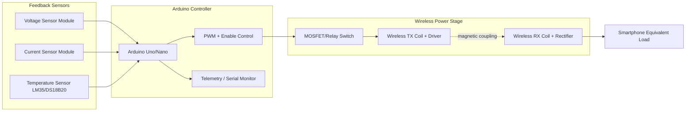

# System Design and Architecture

## 1. Design Objective
The controller regulates wireless charging power transfer using closed-loop feedback from voltage, current, and temperature sensors. The firmware enforces a staged charging profile and safety cutoffs to improve efficiency and protect the load.

## 2. Functional Blocks
1. Power transfer subsystem: transmitter coil driver, receiver coil, rectifier/regulator path.
2. Control subsystem: Arduino Uno/Nano generating PWM and enable control.
3. Sensing subsystem: voltage sensor, current sensor (ACS712), temperature sensor (LM35 or DS18B20).
4. Protection subsystem: software interlocks for thermal, overvoltage, overcurrent, and timeout conditions.
5. Monitoring subsystem: serial telemetry for real-time diagnostics.

## 3. Block Diagram (Text)
- The Arduino samples voltage, current, and temperature.
- A control loop modifies PWM duty and stage enable to regulate charging.
- The power stage excites the transmitter coil.
- Receiver side output feeds smartphone equivalent load.
- Protection logic can immediately disable PWM and force FAULT state.

## 4. Block Diagram (Mermaid)

## 5. Circuit-Level Explanation
1. Arduino PWM output drives MOSFET gate (or relay enable line) through a gate resistor and optional gate driver stage.
2. Coil driver receives switched power and transfers energy wirelessly to receiver coil.
3. Receiver output is rectified and filtered; test setup uses an equivalent battery/load stage for controlled validation.
4. Voltage sensor divider scales receiver output to 0-5V ADC range.
5. Current sensor provides analog proportional output to charging current.
6. Temperature sensor monitors thermal rise near receiver/power stage.
7. Firmware uses thresholds and state machine transitions to regulate and protect operation.

## 6. Recommended Component List
1. Arduino Uno or Nano
2. Wireless charging transmitter/receiver module pair (5V lab-rated)
3. LM35 analog temperature sensor (or DS18B20 digital)
4. Voltage sensor module (resistive divider)
5. ACS712 current sensor module (5A/20A based on setup)
6. Logic-level MOSFET (for power stage control) or relay module
7. DC power source (current-limited bench supply recommended)
8. Capacitors, resistors, LED indicators, wiring accessories

## 7. Design Safety Notes
1. Keep ground references common across sensor and control electronics.
2. Isolate high-current paths from ADC wiring to reduce noise injection.
3. Use fusing/current limits during first power-up.
4. Validate threshold values with known loads before testing with actual devices.
